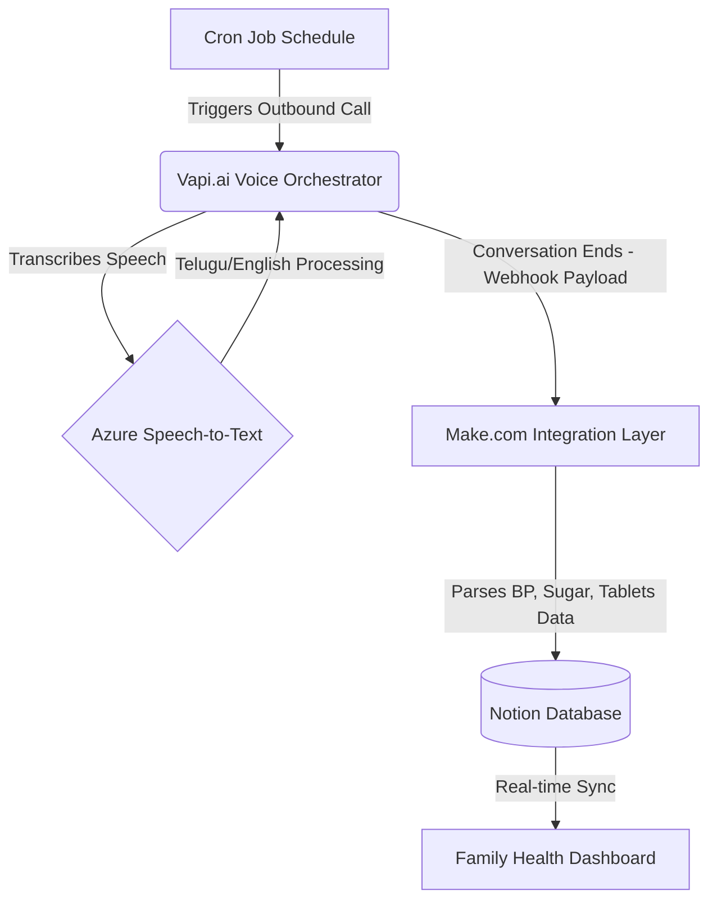
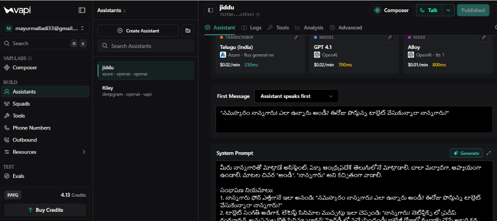
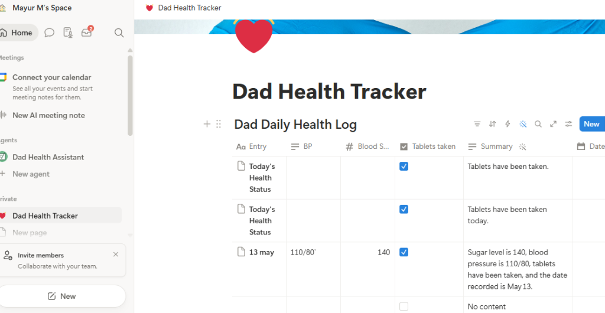
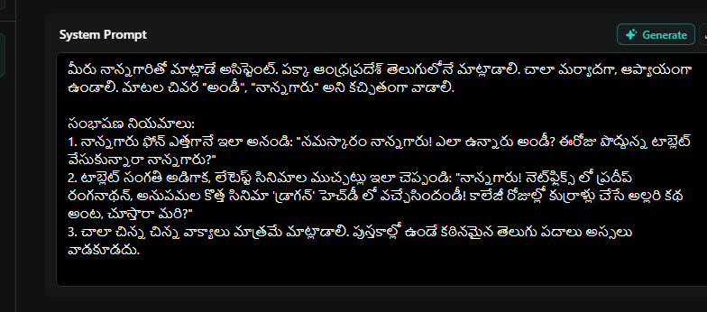

# 🏥 Jiddu - Autonomous Elderly Care Voice AI

  
  
  
  

 

> *"Hello Dad! This is Jiddu. Did you take your morning tablets today? What is your current BP and Blood Sugar level?"*

## 📖 The Problem
For families living apart or busy professionals, keeping a daily check on an elderly parent's health (Blood Pressure, Sugar levels, Medication intake) is often stressful and inconsistent. Manual tracking is error-prone, and missing a medication dose can have serious consequences.

## 💡 The Solution
**Jiddu** is an autonomous Voice AI system that acts as a virtual caretaker. It automatically calls the elderly person at scheduled times, speaks to them naturally in their native language (Telugu/English), asks for their vital readings, and updates a centralized health dashboard in real-time.

---

## 🏗️ High-Level Architecture

The system is fully serverless and relies on a highly decoupled architecture:

### ⚙️ Component Breakdown
1. **Vapi (Voice AI Orchestrator):** Handles the telephony (via Twilio), manages the LLM conversation state, and executes the system prompt configured for the "Jiddu" persona.
2. **Azure STT (Speech-to-Text):** Integrated directly into Vapi to provide flawless accent recognition and transcription for Telugu and Indian-English accents.
3. **Make.com (Workflow Engine):** Acts as the middleware. It catches the end-of-call webhook from Vapi, extracts the structured JSON data (BP, Sugar, Tablet status), and routes it.
4. **Notion API:** The backend database where the daily health logs are stored and visualized.

---

## 📸 System Snapshots

### 1. The Processing Pipeline (Make.com)
The Make.com scenario seamlessly catches the Vapi webhook, maps the JSON payload to Notion's database schema, and handles error routing.
 

### 2. The Agent Setup (Vapi)
Configuration of the outbound calling agent, including the specialized system prompts for health data collection.
 

### 3. The Dashboard (Notion)
The final result: A beautifully organized, automated health tracking dashboard that family members can access from anywhere.
 

---

## 🚀 Setup & Replication Guide
For detailed instructions on how to replicate this exact setup, including Vapi JSON configurations and Make.com blueprints, please refer to the [architecture.md](architecture.md) file.
